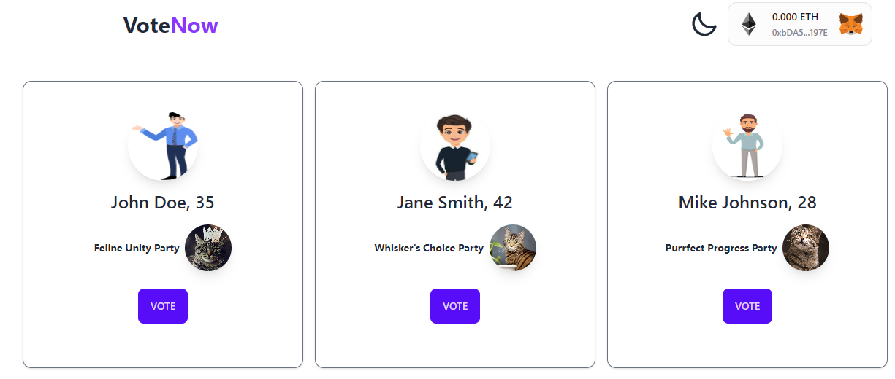

## Voting DApp🚀
This is a decentralized voting application (DApp) built using Hardhat, Tailwind CSS, React, Solidity, and ThirdWeb. Deployed at https://votingdapps2i.netlify.app

### Overview 🌎


The Voting DApp allows users to participate in the voting process for electing the next mayor of the city. The application is built on the Ethereum blockchain (SEPOLITA Testnet), ensuring decentralization and transparency in the voting process.

Users can connect their Metamask wallet to the DApp and cast their votes for their preferred candidate. The blockchain technology ensures the security and immutability of the voting records, making it resistant to manipulation and fraud.

The DApp includes the following key features:

- Countdown: A countdown timer indicating the remaining time for the voting campaign.
- Casted Votes: Display of the total number of votes casted by all users.
- Candidates: List of candidates running for the mayor position, including their names, ages, political parties, and photos.
- Vote: Users can vote for their preferred candidate through the DApp.
- Winner Declaration: Once the voting campaign ends, the contract owner can declare the winner, and the winner's name is displayed to all users.

For further details, take a look at the presentation!

### Technologies Used 🏄
- Hardhat: A development environment for Ethereum smart contracts, providing tools for compilation, testing, and deployment.
- Tailwind CSS: A utility-first CSS framework used for styling the user interface of the DApp.
- React: A JavaScript library for building user interfaces, used to create the front-end of the DApp.
- Solidity: The programming language used to write the smart contracts for the Ethereum blockchain.
- ThirdWeb: A library for interacting with Ethereum smart contracts and the Metamask wallet.

### Getting Started 🔥
Follow the steps below to set up and run the Voting DApp locally:

1. Clone the repository: git clone <https://github.com/diegoddie/VotingDapp-Start2ImpactProject>
2. Install dependencies: ```npm install```
3. Set up the environment variables:
    - Create a .env file in the root directory
    - Define the following variable in the .env file:
        - REACT_APP_WEBSOCKET: The URL of the Ethereum network (e.g., https://sepolia.infura.io/v3/your-infura-project-id)
4. ```cd web3``` and compile the smart contracts: ```npx hardhat compile```
5. Deploy the smart contracts: ```npx hardhat run scripts/deploy.js --network sepolia```
6. ```cd..``` and then ```cd client``` Start the React development server: ```npm start```
7. Access the DApp in your browser at http://localhost:3000
8. Note: Make sure you have Metamask installed and some Sepolia ETH.

### Contact me 💚
For any inquiries or questions, feel free to reach out:

Email: diego.boost@gmail.com
